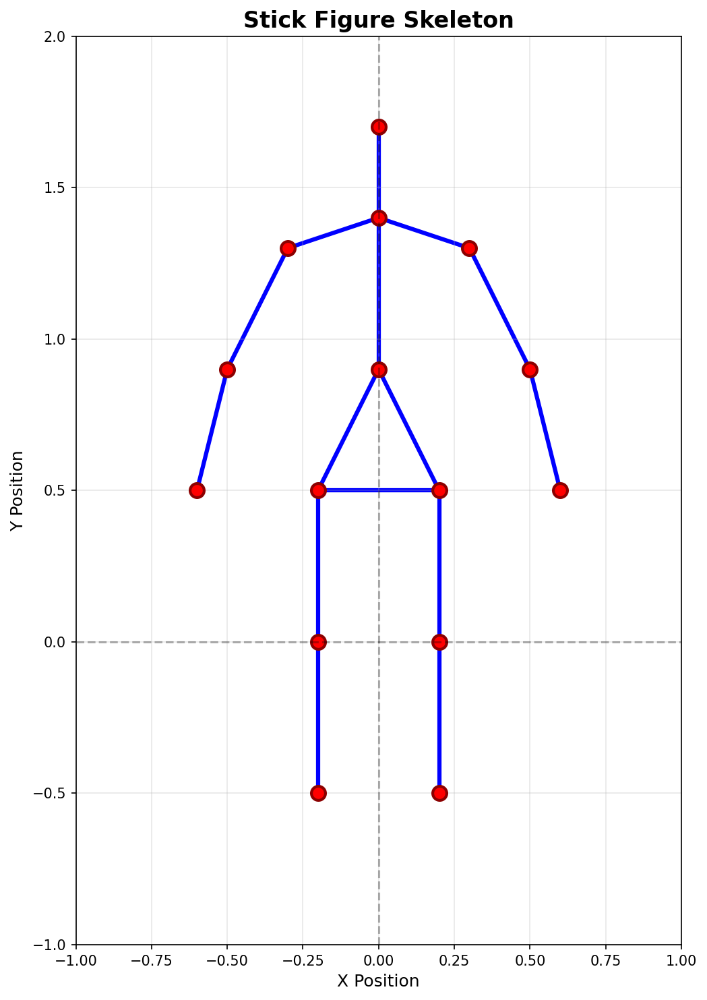

# Stick Figure Skeleton Visualization from 2D Joint Coordinates

A Python project that generates and visualizes human stick-figure skeletons using predefined body joint coordinates. This demonstrates core concepts behind pose-based animation pipelines used in computer vision systems such as motion tracking and human pose estimation.



## Project Description

This project simulates the fundamental representation used in pose estimation systems. Instead of detecting poses from images (which requires models like MediaPipe or OpenPose), we work directly with 2D joint coordinates to understand how skeletal structures are represented and animated in computer vision pipelines.

**Relevance to Computer Vision & Animation:**
- **Pose Estimation**: Real pose detection systems output joint coordinates similar to those used here
- **Motion Tracking**: The animation demonstrates how pose sequences create motion
- **Skeletal Animation**: Shows the foundation of character rigging in game engines and animation software
- **Data Representation**: Illustrates how human pose can be encoded as structured coordinate data

## Features

- **✓ 15-Joint Human Skeleton Model**: Anatomically structured body representation
- **✓ Realistic Skeleton Connections**: Proper bone structure connecting head, torso, arms, and legs
- **✓ Interactive Visualization**: Clean matplotlib-based rendering
- **✓ Multiple Animation Modes**:
  - Static pose visualization
  - Waving animation (arm movement)
  - Walking animation (coordinated limb motion)
- **✓ Modular Class Design**: Easy to extend and modify
- **✓ Joint Update System**: Programmatic control of individual joint positions
- **✓ Proper Proportions**: Realistic human body ratios

## Technologies Used

- **Python 3.7+**: Core programming language
- **Matplotlib**: Visualization and animation framework
- **NumPy**: Numerical computations for smooth motion

## Joint Structure

The skeleton consists of 15 key joints:

```
Head & Torso: head, neck, spine_mid, left_shoulder, right_shoulder, left_hip, right_hip
Arms: left_elbow, left_wrist, right_elbow, right_wrist  
Legs: left_knee, left_ankle, right_knee, right_ankle
```

## How to Run

### Prerequisites

Ensure you have Python 3.7 or higher installed.

### Running the Program

Execute the main script:
```bash
python stick_figure.py
```

You'll see a menu with three options:
1. **Static pose** - Generates and saves `output.png`
2. **Waving animation** - Animated arm waving motion
3. **Walking animation** - Coordinated walking motion with arm swing

Simply enter your choice (1, 2, or 3) or press Enter for the default static pose.

### Expected Output

- A graphical window displaying the stick figure
- For static mode: An `output.png` file saved in the project directory
- For animations: Real-time animated motion until window is closed

## 📁 Project Structure

```
stick-figure-from-keypoints/
│
├── stick_figure.py       # Main program with StickFigure class
├── README.md             # This file
├── requirements.txt      # Python dependencies
└── output.png           # Generated output image (after running)
```

## 💡 Code Overview

### Key Components

**StickFigure Class:**
- `__init__()`: Defines joint positions and skeleton connections
- `plot_skeleton()`: Renders the stick figure
- `update_joint()`: Modifies individual joint positions
- `animate_wave()`: Creates arm waving animation
- `animate_walk()`: Creates walking animation


## 🔮 Future Improvements

### Short-term Enhancements
- [ ] Add more joint details (fingers, toes, facial landmarks)
- [ ] Implement pose smoothing and interpolation
- [ ] Export animations as GIF or MP4
- [ ] Add collision detection for realistic motion bounds

### Advanced Extensions
- [ ] **Real Pose Detection**: Integrate MediaPipe or OpenPose for live webcam pose tracking
- [ ] **Motion Capture Pipeline**: Record and replay pose sequences
- [ ] **3D Visualization**: Extend to 3D coordinates with depth
- [ ] **Pose Classification**: Add ML to classify poses (standing, sitting, jumping)
- [ ] **Multi-person Support**: Track and visualize multiple skeletons
- [ ] **Full Kinemation System**: Create complete motion animation pipeline
- [ ] **Pose Dataset Support**: Load from COCO, MPII, or custom datasets

## Use Cases

This foundational project can be extended for:
- **Fitness Applications**: Exercise form analysis
- **Gaming**: Character animation and motion capture
- **Healthcare**: Gait analysis and rehabilitation monitoring
- **Sports Analytics**: Athlete performance tracking
- **Surveillance**: Human activity recognition
- **VR/AR**: Avatar control and motion tracking


## License

This project is open source and available for educational purposes.


---

